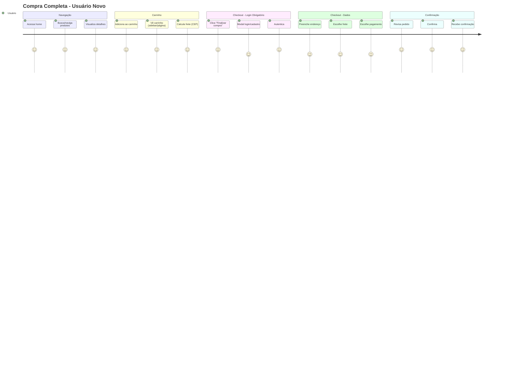
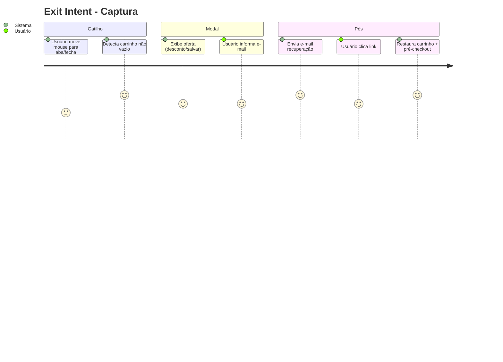
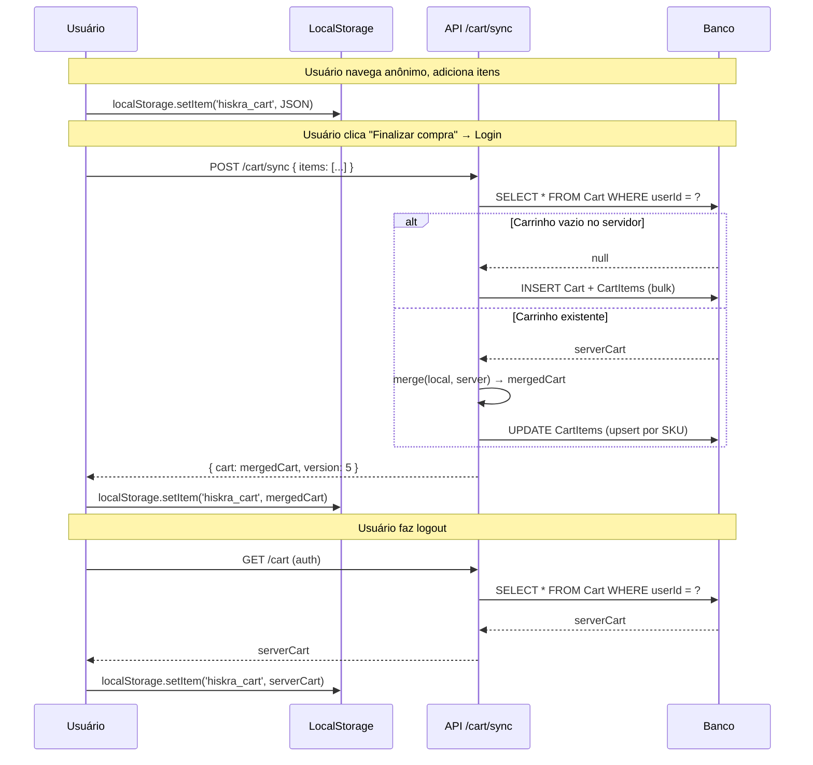

# Requisitos - Hiskra Store

---

## Contexto do Negócio
Loja virtual (e-commerce) com foco em conversão: permitir navegação e montagem de carrinho sem cadastro, exigindo login **apenas** no checkout final ou ao tentar sair da página sem concluir a compra (exit intent). Integração futura com Bling (ERP) e Cosmic JS (CMS de produtos).

---

## 1. Requisitos Funcionais (RF)

| ID | Requisito | Descrição Detalhada | Prioridade (MoSCoW) | Critérios de Aceitação |
|----|-----------|---------------------|---------------------|------------------------|
| **RF-01** | **Listagem pública de produtos** | Exibir vitrine de produtos (nome, imagem, preço, descrição curta) sem autenticação. Suportar paginação, ordenação (preço, nome, novidades) e filtros (categoria, faixa de preço). | **Must** | • Acesso via GET `/produtos` sem token<br>• Resposta < 500ms (p95)<br>• SEO-friendly (SSR/ISR) |
| **RF-02** | **Detalhe do produto** | Página de produto com: galeria de imagens, descrição completa, especificações, preço, estoque, avaliações, botão "Adicionar ao carrinho", cálculo de frete (CEP). | **Must** | • Rota `/produtos/[slug]` pública<br>• Estoque atualizado em tempo real<br>• Frete calculado via CEP sem login |
| **RF-03** | **Cálculo de frete (público)** | Permitir simular frete informando CEP na página do produto ou no carrinho. Retornar opções (PAC, Sedex, transportadora), prazo e valor. | **Must** | • Endpoint público `POST /frete/calcular`<br>• Cache de CEPs válidos (24h)<br>• Tratar CEP inválido com mensagem clara |
| **RF-04** | **Carrinho anônimo (localStorage)** | Adicionar/remover/atualizar itens no carrinho sem login. Persistir em `localStorage` (chave `hiskra_cart`) com: `items[]`, `frete`, `subtotal`, `total`, `updatedAt`. Sincronizar com backend quando houver login. | **Must** | • Funciona 100% offline (localStorage)<br>• Limite: 50 itens / 99 unidades por item<br>• Expiração: 30 dias sem atividade |
| **RF-05** | **Carrinho autenticado (servidor)** | Após login, migrar carrinho local para banco (tabela `Cart` + `CartItem`). Sincronização bidirecional: alterações no dispositivo A refletem no B. | **Must** | • Merge inteligente (somar quantidades de SKU duplicado)<br>• WebSocket/SSE para sync multi-aba<br>• Persistência imediata |
| **RF-06** | **Checkout - Etapa 1: Identificação** | **Ponto obrigatório de login/cadastro**. Modal ou página dedicada. Opções: login (e-mail/senha, social Google/GitHub), cadastro rápido (nome, e-mail, senha), checkout como convidado (apenas e-mail + telefone). | **Must** | • Bloqueia avanço sem autenticação<br>• Validação de e-mail único<br>• LGPD: consentimento termos + marketing opcional |
| **RF-07** | **Checkout - Etapa 2: Endereço** | Formulário de endereço de entrega e cobrança (podem ser iguais). Busca automática de CEP (ViaCEP/BrasilAPI). Salvar endereços no perfil do usuário. | **Must** | • Validação de CEP + número obrigatório<br>• Múltiplos endereços por usuário<br>• Endereço padrão pré-selecionado |
| **RF-08** | **Checkout - Etapa 3: Frete** | Exibir opções calculadas anteriormente. Permitir alterar CEP (recalcula). Seleção obrigatória de uma modalidade. | **Must** | • Recalculo < 2s<br>• Exibir prazo estimado + valor<br>• Default: menor preço |
| **RF-09** | **Checkout - Etapa 4: Pagamento** | Integração com gateway (Mercado Pago, Stripe, Asaas). Suportar: PIX (QR Code + copia e cola), Cartão (crédito/débito, parcelado), Boleto. Webhook para confirmação assíncrona. | **Must** | • Tokenização de cartão (PCI DSS SAQ A)<br>• PIX expira em 30 min<br>• Idempotência via `idempotency_key` |
| **RF-10** | **Checkout - Etapa 5: Confirmação** | Resumo do pedido: itens, endereço, frete, pagamento, total. Botão "Confirmar pedido" → cria `Order` no banco, limpa carrinho, envia e-mail/WhatsApp de confirmação. | **Must** | • Transação atômica (pedido + pagamento + estoque)<br>• Número do pedido formato `HSK-YYYYMMDD-XXXX`<br>• E-mail transacional < 1 min |
| **RF-11** | **Exit Intent - Captura de abandono** | Detectar intenção de saída (mouse leave viewport superior, `beforeunload`, scroll up rápido). Exibir modal: "Finalize sua compra com 10% OFF" ou "Cadastre-se para salvar carrinho". Requer e-mail para enviar link de recuperação. | **Should** | • Trigger apenas se carrinho não vazio<br>• Frequência: 1x por sessão / 24h<br>• Métrica: taxa de conversão do modal |
| **RF-12** | **Recuperação de carrinho abandonado** | E-mail automático 1h, 24h e 72h após abandono (carrinho com itens + checkout iniciado não finalizado). Link com token JWT (expira 7 dias) que restaura carrinho e pré-preenche checkout. | **Should** | • Opt-out no rodapé do e-mail<br>• Token single-use<br>• Tracking de abertura/clique (UTM) |
| **RF-13** | **Gestão de pedidos (cliente)** | Área logada: listar pedidos, ver detalhes, status (processando, enviado, entregue, cancelado), rastreio, nota fiscal, reembolso, comprar novamente. | **Must** | • Status sincronizado com Bling (webhook)<br>• PDF da nota fiscal download<br>• Reembolso: solicitação + aprovação admin |
| **RF-14** | **Gestão de perfil** | Editar dados cadastrais, senha, endereços, preferências de comunicação, histórico de navegação, wishlist (futuro). | **Could** | • Exclusão de conta (LGPD Art. 18)<br>• 2FA opcional (TOTP) |
| **RF-15** | **Busca e filtros avançados** | Busca full-text (nome, descrição, tags), autocomplete, sugestões, filtros facetas (categoria, marca, preço, atributos), ordenação. | **Should** | • Algolia/Meilisearch ou Postgres FTS<br>• Latência < 100ms<br>• Sinônimos e correção ortográfica |
| **RF-16** | **Cupons de desconto** | Aplicar cupom no carrinho/checkout: % off, valor fixo, frete grátis, produto grátis. Regras: validade, uso único/por usuário, valor mínimo, categorias específicas, primeira compra. | **Could** | • Validação server-side obrigatória<br>• Stack de cupons (configurável)<br>• Relatório de uso por campanha |
| **RF-17** | **Integração Bling (ERP)** | Sincronizar: produtos/estoque (pull), pedidos (push), notas fiscais (pull), status de envio (push). Agendamento: produtos 6h/6h, pedidos imediato via webhook. | **Must** (futuro) | • Mapeamento de SKU ↔ Bling ID<br>• Fila de retentativa (exponential backoff)<br>• Log de sincronização auditável |
| **RF-18** | **Integração Cosmic JS (CMS)** | Produtos gerenciados no Cosmic: campos customizados (atributos variantes, SEO, mídia). Webhook para revalidação de cache (ISR) no Next.js. | **Must** (futuro) | • Preview mode para drafts<br>• Imagens otimizadas (next/image + CDN)<br>• Fallback se CMS indisponível |

---

## 2. Requisitos Não Funcionais (RNF)

| ID | Categoria | Requisito | Métrica / Alvo |
|----|-----------|-----------|----------------|
| **RNF-01** | **Performance** | Tempo de carregamento inicial (LCP) | < 2.5s (mobile 4G) |
| **RNF-02** | **Performance** | Time to Interactive (TTI) | < 3.5s |
| **RNF-03** | **Performance** | API response time (p95) | < 300ms (cache hit), < 800ms (miss) |
| **RNF-04** | **Disponibilidade** | Uptime mensal | ≥ 99.9% |
| **RNF-05** | **Escalabilidade** | Suporte a usuários simultâneos | 10k+ (auto-scaling Vercel + Redis) |
| **RNF-06** | **Segurança** | LGPD / GDPR compliance | Consentimento, direito ao esquecimento, DPIA |
| **RNF-07** | **Segurança** | PCI DSS (pagamentos) | SAQ A (gateway tokenizado) |
| **RNF-08** | **Segurança** | Proteção contra bots (checkout) | hCaptcha/turnstile invisível + rate limit |
| **RNF-09** | **Segurança** | Headers de segurança | CSP, HSTS, X-Frame-Options, Referrer-Policy |
| **RNF-10** | **Observabilidade** | Logs estruturados (JSON) | Correlation ID, nível, timestamp, contexto |
| **RNF-11** | **Observabilidade** | Métricas de negócio | Conversão, ticket médio, abandono, CAC |
| **RNF-12** | **Observabilidade** | Alertas | Erro 5xx > 1%/5min, latência p99 > 2s, fila webhook > 100 |
| **RNF-13** | **Acessibilidade** | WCAG 2.1 AA | Contraste, navegação teclado, ARIA, alt text |
| **RNF-14** | **SEO** | Core Web Vitals + dados estruturados | Product, Breadcrumb, Organization, FAQ schema |
| **RNF-15** | **Internacionalização** | PT-BR (inicial), preparado para EN/ES | i18n routing, moeda, formato data |
| **RNF-16** | **Manutenibilidade** | Cobertura de testes | Unit ≥ 80%, Integration ≥ 60%, E2E críticos 100% |
| **RNF-17** | **Manutenibilidade** | Deploy | Zero-downtime, rollback < 2min, feature flags |

---

## 3. Fluxos de Usuário

### 3.1 Fluxo Principal: Compra Completa (Usuário Novo)


### 3.2 Fluxo: Usuário Recorrente (Já Logado)
- Pula etapa de login no checkout
- Endereços pré-preenchidos
- Carrinho sincronizado entre dispositivos

### 3.3 Fluxo: Exit Intent (Abandono)


### 3.4 Fluxo: Compra como Convidado (Guest Checkout)
- No modal de login: opção "Continuar sem conta"
- Solicita apenas e-mail + telefone
- Cria `User` com `role=GUEST`, `password=null`
- Pós-compra: convite para criar senha e virar conta completa

---

## 4. Regras de Negócio (RN)

| ID | Regra | Descrição |
|----|-------|-----------|
| **RN-01** | **Acesso público total a produtos** | Nenhuma rota de catálogo (`/produtos`, `/produtos/[slug]`, `/categorias/[slug]`, `/busca`) exige autenticação. |
| **RN-02** | **Frete público** | Cálculo de frete disponível sem login em qualquer momento (PDP, carrinho, checkout antes do login). |
| **RN-03** | **Carrinho anônimo persistente** | `localStorage` com TTL 30 dias. Não expira ao fechar navegador. Limite: 50 SKUs únicos, 99 unid/SKU. |
| **RN-04** | **Login obrigatório APENAS em 2 momentos** | 1) Botão "Finalizar compra" no carrinho/checkout<br>2) Evento `exit-intent` disparado (carrinho não vazio). |
| **RN-05** | **Merge de carrinho no login** | Ao autenticar: `serverCart = merge(localCart, serverCart)` somando quantidades por SKU. Conflito de preço: usar preço atual do servidor. |
| **RN-06** | **Checkout como convidado permitido** | Cria usuário `GUEST` com e-mail único. Não exige senha. Pedido vinculado a esse usuário. |
| **RN-07** | **Estoque reservado no pagamento** | PIX: reserva 30 min. Cartão: reserva na autorização. Boleto: reserva 2 dias úteis. Liberação automática se expirar. |
| **RN-08** | **Preço travado no carrinho** | Preço do item fixado no momento da adição (`unitPrice` salvo no carrinho). Alteração de preço no admin não afeta carrinhos existentes. |
| **RN-09** | **Cupom: validação server-side** | Nunca confiar no front. Validar: validade, uso, mínimo, categorias, primeira compra, stack. |
| **RN-10** | **Pedido: transação atômica** | `Order` + `OrderItems` + `Payment` + `StockReservation` em transação única. Falha → rollback total. |
| **RN-11** | **Numeração do pedido** | Formato: `HSK-YYYYMMDD-XXXX` (sequencial diário). Único, legível, rastreável. |
| **RN-12** | **Exit intent: frequência controlada** | Máx 1 exibição por sessão. Cookie `hiskra_exit_shown=true` (24h). Não exibir se já converteu na sessão. |
| **RN-13** | **Recuperação: token single-use** | JWT com `jti` único, expiração 7 dias, invalida ao usar. Link: `/checkout/recuperar?token=xxx`. |
| **RN-14** | **LGPD: consentimento granular** | Checkboxes separados: Termos (obrigatório), Marketing (opcional), Analytics (opcional). Registro de consentimento com timestamp/IP. |
| **RN-15** | **Sincronização Bling: idempotência** | Chave de idempotência: `bling_pedido_{numero}`. Evita duplicidade em retentativas. |

---

## 5. Estados do Carrinho: Anônimo vs Autenticado

### 5.1 Estrutura de Dados (Unificada)

```typescript
interface CartItem {
  sku: string;           // SKU do produto (ex: "CAM-001-P-M")
  productId: string;     // ID no Cosmic/Blink
  variantId?: string;    // ID da variante (cor/tamanho)
  name: string;
  slug: string;
  image: string;         // URL thumbnail
  unitPrice: number;     // Preço congelado no momento da adição (centavos)
  quantity: number;      // 1-99
  maxStock: number;      // Estoque disponível no momento
  attributes: Record<string, string>; // { cor: "Preto", tamanho: "M" }
}

interface CartState {
  items: CartItem[];
  shipping: {
    zipCode: string;
    optionId: string;    // "pac", "sedex", "transportadora-x"
    price: number;       // centavos
    deliveryDays: number;
  } | null;
  coupon: {
    code: string;
    discountType: 'percent' | 'fixed' | 'free_shipping';
    discountValue: number;
  } | null;
  subtotal: number;      // soma(unitPrice * quantity) - centavos
  shippingCost: number;  // centavos
  discount: number;      // centavos
  total: number;         // centavos
  itemCount: number;     // soma quantities
  updatedAt: string;     // ISO 8601
  version: number;       // Para otimistic locking (sync)
}
```

### 5.2 Comparativo de Comportamento

| Aspecto | **Carrinho Anônimo (localStorage)** | **Carrinho Autenticado (Servidor)** |
|---------|--------------------------------------|--------------------------------------|
| **Armazenamento** | `localStorage.hiskra_cart` (JSON) | PostgreSQL: `Cart` + `CartItem` |
| **Persistência** | 30 dias inatividade | Indefinida (enquanto usuário ativo) |
| **Dispositivos** | Isolado por navegador | Sincronizado multi-dispositivo |
| **Capacidade** | ~5MB (browser limit) | Ilimitada (banco) |
| **Segurança** | XSS risk (mitigar: sanitização) | Server-side, autenticação JWT |
| **Merge no login** | → Enviado para API `/cart/sync` | ← Recebe do servidor, sobrescreve local |
| **Merge no logout** | ← Recebe do servidor, salva local | → Limpa servidor? **Não** (mantém para próximo login) |
| **Expiração itens** | Verifica `maxStock` no checkout | Verifica estoque real-time no `GET /cart` |
| **Preço travado** | `unitPrice` salvo no item | `unitPrice` salvo no `CartItem` |
| **Frete** | Calculado via CEP, salvo no estado | Recalculado automaticamente se CEP mudar |
| **Cupom** | Validado ao aplicar (chamada API) | Validado + persistido no `Cart.couponId` |

### 5.3 Fluxo de Sincronização (Login/Logout)



### 5.4 Eventos de Atualização (Server-Sent Events / WebSocket)

| Evento | Payload | Ação Frontend |
|--------|---------|---------------|
| `cart:updated` | `{ version, items[], total }` | Substituir estado local, recalcular UI |
| `cart:item_outofstock` | `{ sku, availableQty }` | Ajustar quantidade, toast "Estoque reduzido" |
| `cart:price_changed` | `{ sku, oldPrice, newPrice }` | Atualizar preço, badge "Preço atualizado" |
| `cart:coupon_applied` | `{ code, discount }` | Aplicar desconto visual |
| `cart:coupon_removed` | `{ code }` | Remover desconto |
| `cart:cleared` | `{}` | Limpar carrinho (pós-pedido) |

---

## 6. Gaps & Decisões Pendentes

| Item | Descrição | Responsável | Prazo |
|------|-----------|-------------|-------|
| Gateway de pagamento | Definir: Mercado Pago vs Stripe vs Asaas | PO/Tech Lead | Sprint 1 |
| Transportadoras | Quais integrar (Correios, Jadlog, Melhor Envio) | PO/Logística | Sprint 2 |
| Cosmic JS schema | Definir content model de produtos/variantes | Tech Lead + Content | Sprint 1 |
| Bling webhook | Mapear eventos: pedido criado, pago, enviado, cancelado | Backend | Sprint 3 |
| Exit intent: oferta | % desconto ou "salvar carrinho"? A/B test? | Marketing | Sprint 2 |
| Guest checkout | Manter conta guest ou converter obrigatoriamente? | PO/Legal | Sprint 1 |
| LGPD: DPO | Nomear DPO, registrar processamento | Legal | Pré-lançamento |

---

## 7. Priorização (MoSCoW Resumido)

| Prioridade | Itens |
|------------|-------|
| **Must** | RF-01 a RF-10, RF-13, RF-17, RF-18, RN-01 a RN-15, RNF-01 a RNF-14 |
| **Should** | RF-11, RF-12, RF-15, RNF-15 |
| **Could** | RF-14, RF-16, RNF-16, RNF-17 |
| **Won't (v1)** | Wishlist, Programa fidelidade, Marketplace, App mobile nativo |

---

## 8. Critérios de Pronto (Definition of Done - Requisitos)

- [ ] Todos os RFs têm critérios de aceitação claros e testáveis
- [ ] RNFs têm métricas quantificáveis e ferramentas de medição definidas
- [ ] Regras de negócio não conflitam entre si (validação cruzada)
- [ ] Fluxos cobrem: happy path, edge cases (estoque zero, pagamento falhou, rede instável)
- [ ] Estados do carrinho documentados com estrutura de dados unificada
- [ ] Gaps registrados com owner e prazo
- [ ] Aprovado por PO + Tech Lead + UX

---

*Documento gerado em 22/08/2026 — Versão 1.0*  
*Autor: VIBECODE (Analista de Requisitos)*  
*Base: Regras de negócio fornecidas pelo stakeholder*